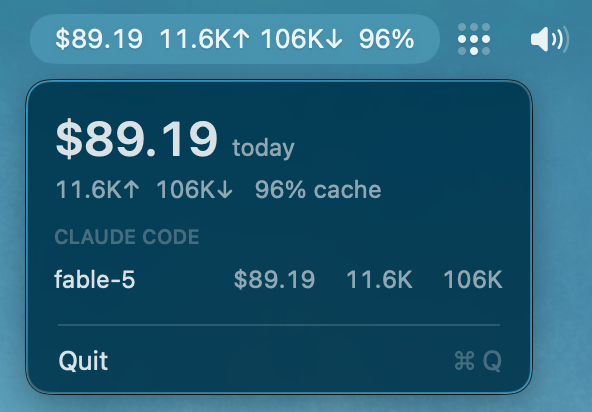

# token-bar

A minimal macOS menu bar app showing today's AI usage: spend, tokens in/out, and cache hit rate.

<p align="center">
  
</p>

The numbers roll odometer-style whenever new usage lands. Click the item for a panel with the day's totals and a per-tool, per-model breakdown.

## Supported tools

| Tool | Source | Cost |
|---|---|---|
| [Claude Code](https://claude.com/claude-code) | `~/.claude/projects/**/*.jsonl` | Computed from published API rates |
| [OpenCode](https://opencode.ai) | `~/.local/share/opencode/opencode.db` | OpenCode's own per-message cost |
| [pi](https://github.com/badlogic/pi-mono) | `~/.pi/agent/sessions/**/*.jsonl` | pi's own per-message cost |

Updates are instant: file-system events fire the moment a session writes new usage (coalesced to at most about one refresh per second while streaming), with a 60s timer as backstop and for the midnight rollover. Tools with no activity today are hidden from the panel.

## Install

### Homebrew

```sh
brew install shrivara/tap/token-bar
brew services start token-bar   # start now + at login
```

### From source

Requires macOS 14+ and the Xcode Command Line Tools.

```sh
git clone https://github.com/shrivara/token-bar
cd token-bar
./build.sh
open TokenBar.app
```

Add `TokenBar.app` to System Settings → Login Items to start it at login.

### Check the numbers without the app

```sh
token-bar --print   # or ./TokenBar.app/Contents/MacOS/TokenBar --print
```

Prints today's per-model breakdown and totals to stdout, then exits.

## Notes

- Spend is API-equivalent pricing. If you're on a subscription plan (e.g. Claude Max), the dollar figure shows what the usage *would* cost via the API, not what you're billed.
- OpenCode and pi record their own per-message cost (covering any provider they support), so token-bar just sums those. Claude Code logs tokens only, so Claude pricing is a small hardcoded table in `Sources/token-bar/main.swift`; unknown models fall back to Opus rates and are marked `~` in the panel.
- Everything is read locally. No network access, no telemetry.

## License

MIT
