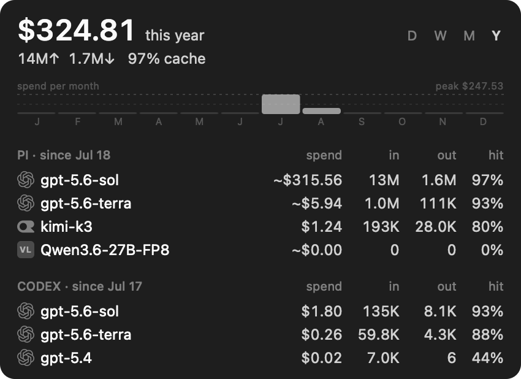

# token-bar

A macOS menu bar app for local AI usage: spend, input/output tokens, and cache hit rate.

<p align="center">
  
</p>

Left-click for day, week, month, or year totals, a spend graph, model breakdowns, and screenshots. Right-click to choose menu bar metrics, panel display options, a color theme, and calendar or relative period ranges, or quit.

System follows the macOS appearance. Built-in dark themes include Catppuccin Mocha, Dracula, Gruvbox Dark, Nord, Solarized Dark, and Tokyo Night; light themes include Catppuccin Latte, GitHub Light, Gruvbox Light, and Solarized Light.

An experimental **Projects & Sessions** panel groups usage across agents by Git root or working directory and shows the highest-usage sessions. Folder icons open projects in Finder, while session names resume the corresponding agent session in Terminal. Enable it in the **Experimental** section under **Show in Panel**.

## Supported tools

| Tool | Local data |
|---|---|
| [Claude Code](https://claude.com/claude-code) | `~/.claude/projects/**/*.jsonl` |
| [Codex](https://developers.openai.com/codex/) | `~/.codex/sessions/**/*.jsonl` |
| [OpenCode](https://opencode.ai) | `~/.local/share/opencode/opencode.db` |
| [pi](https://github.com/badlogic/pi-mono) | `~/.pi/agent/sessions/**/*.jsonl` |

Token Bar watches these sources for changes and refreshes immediately, with a 60-second fallback.

## Homebrew

### Install

```sh
brew install shrivara/tap/token-bar
brew services start token-bar   # start now + at login
```

### Update

```sh
brew update
brew upgrade token-bar
brew services restart token-bar
```

## Notes

- Spend is API-equivalent pricing, not your subscription bill.
- Rates come from a bundled [models.dev](https://models.dev/) snapshot, including mode-specific prices such as `-fast`. Qualified-provider, namespaced-model, or stripped-qualifier fallback matches are estimates marked `~`; unresolved prices contribute `$0` and are also marked `~`.
- Everything stays local: no network access or telemetry.

## License

MIT
